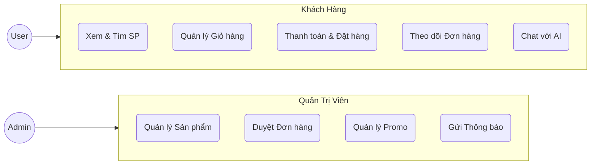
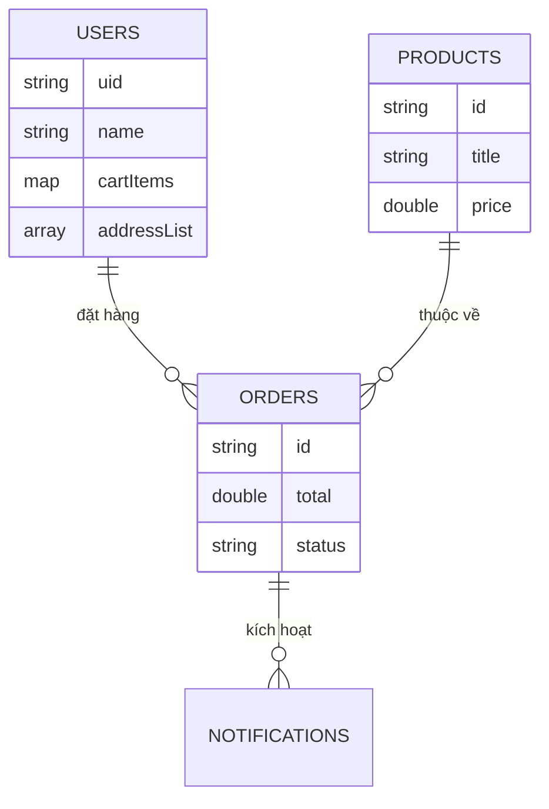
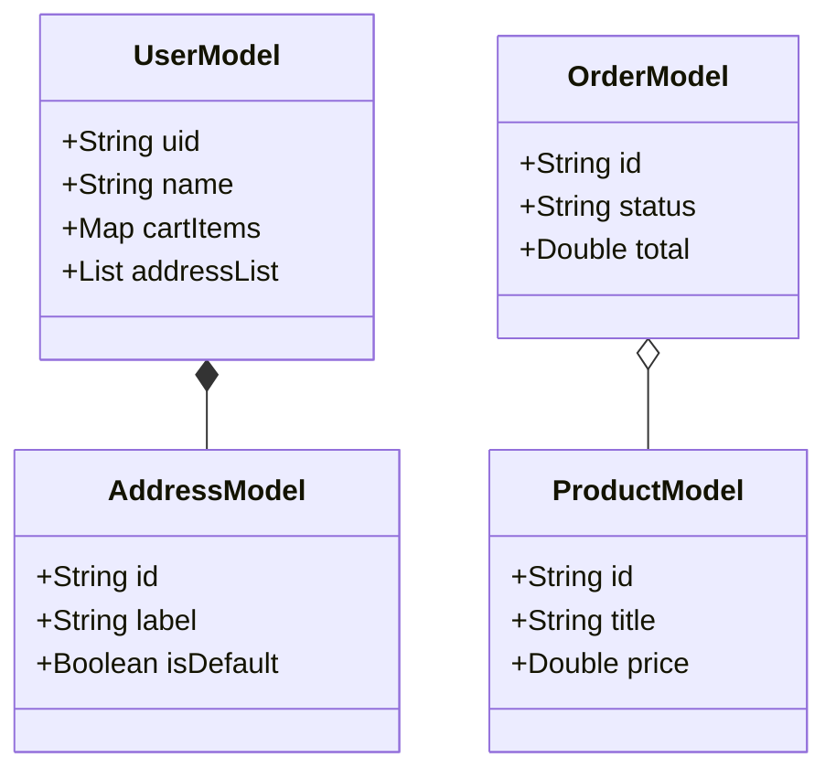

# 🌟 EasyShop - Android E-Commerce Real-time Application
> **Đồ án tốt nghiệp: Xây dựng hệ thống thương mại điện tử đa nền tảng với Jetpack Compose & Firebase**

---

## 📖 Giới thiệu (Overview)

**EasyShop** là một giải pháp thương mại điện tử di động toàn diện, được thiết kế để mang lại trải nghiệm mua sắm mượt mà, phản hồi tức thì (Real-time) và tối ưu hóa hiệu năng trên nền tảng Android. Ứng dụng áp dụng những công nghệ tiên tiến nhất hiện nay như **Jetpack Compose** cho giao diện hiện đại và **Firebase** làm kiến trúc Backend-as-a-Service (BaaS).

### 🎯 Mục tiêu dự án
- Xây dựng hệ thống bán hàng đa vai trò (User & Admin).
- Tối ưu hóa trải nghiệm người dùng với hệ thống thông báo đẩy (Push Notifications).
- Tích hợp trí tuệ nhân tạo (AI Assistant) hỗ trợ tư vấn 24/7.
- Đảm bảo tính toàn vẹn dữ liệu trong môi trường NoSQL thông qua Snapshot Pattern.

---

## 🛠️ Công Nghệ Sử Dụng (Tech Stack)

| Tầng (Layer) | Công nghệ / Thư viện | Vai trò |
| :--- | :--- | :--- |
| **Giao diện (UI)** | Jetpack Compose, Material Design 3 | Thiết kế UI khai báo, linh hoạt và hiện đại. |
| **Kiến trúc** | MVVM (Model-View-ViewModel) | Đảm bảo logic nghiệp vụ tách biệt với giao diện. |
| **Ngôn ngữ** | Kotlin (Coroutines & Flow) | Xử lý bất đồng bộ và luồng dữ liệu thời gian thực. |
| **Backend** | Firebase Authentication | Quản lý đăng nhập Email & Google. |
| **Database** | Cloud Firestore (NoSQL) | Lưu trữ và đồng bộ hóa dữ liệu thời gian thực. |
| **AI** | Generative AI SDK | Tích hợp Trợ lý ảo tư vấn khách hàng. |

---

## 🗺️ Đặc tả Use Case (Use Case Specification)

---

## 🏗️ Kiến Trúc Hệ Thống (Architecture)

### 1. Kiến trúc Database NoSQL (Firestore)
- **Embedded Pattern:** Nhúng mảng địa chỉ (`addressList`) vào tài liệu `User`.
- **Reference Pattern:** Giỏ hàng (`cartItems`) lưu dưới dạng `Map<ProductId, Quantity>`.
- **Snapshot Pattern:** Chụp ảnh thông tin sản phẩm và giá tại thời điểm chốt đơn hàng (`Order`) để đảm bảo tính lịch sử.

### 2. Sơ đồ Thực thể (ERD Mermaid)

### 3. Sơ đồ Lớp (Class Diagram)

---

## 💎 Tính Năng Nổi Bật (Key Features)

### 1. Hệ thống Thông báo Real-time (Dual-Layer Notification)
- **In-app Banner:** Sử dụng `NotifBannerOverlay` trượt từ trên xuống với hiệu ứng bounce, tích hợp `SharedFlow` để lắng nghe thay đổi trạng thái đơn hàng ngay khi người dùng đang mở app.
- **System Push:** Kết hợp Firebase Messaging để bắn thông báo ngay cả khi app đang chạy ngầm hoặc đã đóng.

### 2. Trợ Lý Ảo AI (AI Copilot)
- Tích hợp **Generative AI** tư vấn sản phẩm dựa trên nhu cầu (ngân sách, mục đích sử dụng).
- Hỗ trợ xem nhanh sản phẩm (Quick View Assist Chips) trực tiếp từ khung chat.

### 3. Quy trình Thanh toán & Promo
- Áp dụng mã giảm giá (`PromoCodeModel`) linh hoạt theo phần trăm hoặc số tiền cố định.
- Quản lý địa chỉ giao hàng và phương thức thanh toán đa dạng.

---

## 📸 Hình ảnh Minh họa (Screenshots)

| Trang Chủ | Chi Tiết Sản Phẩm | Trợ Lý AI |
| :---: | :---: | :---: |
|  |  |  |

| Giỏ Hàng | Thông Báo | Quản Trị (Admin) |
| :---: | :---: | :---: |
|  |  |  |

---

## 🤝 Liên hệ
- **Tác giả:** [Tên của bạn]
- **Email:** [Email của bạn]
- **Trường:** [Tên trường của bạn]

---
*© 2024 EasyShop Project - Graduation Thesis.*
