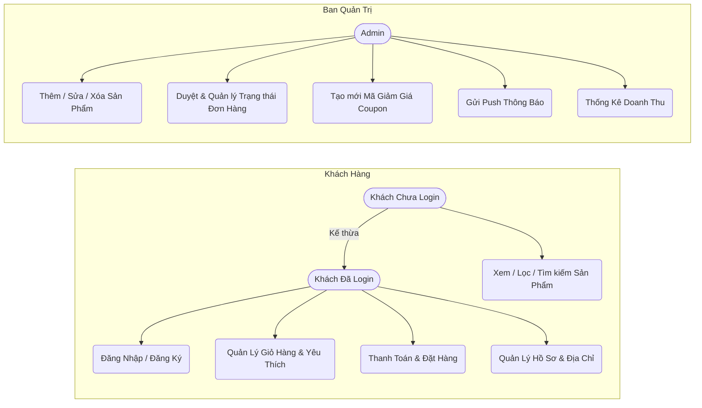
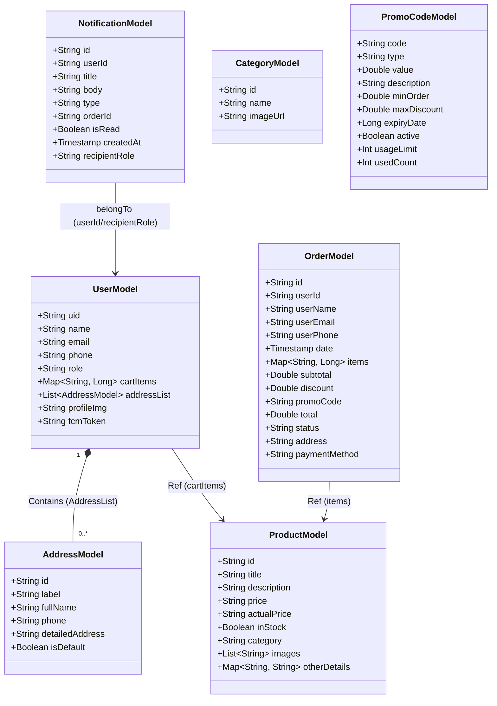

# EasyShop – Ứng Dụng E-Commerce Android (Jetpack Compose)

Đây là tài liệu phân tích và thiết kế hệ thống cho ứng dụng e-commerce **EasyShop**, xây dựng trên nền tảng **Android Jetpack Compose** và **Firebase (Authentication, Firestore, Storage, Cloud Messaging)**.

---

## Công Nghệ Sử Dụng

| Tầng | Công nghệ |
| :--- | :--- |
| **Frontend** | Android / Kotlin (Jetpack Compose) |
| **Backend & DB** | Firebase (Cloud Firestore) |
| **Auth** | Firebase Authentication (Email/Password & Google SignIn) |
| **Storage** | Firebase Cloud Storage |
| **Payment** | Thanh toán thụ động (Thanh toán khi nhận hàng - COD) |
| **Service** | Firebase Cloud Messaging (FCM Push Notifications) |
| **Image Loader**| Coil (Kích hoạt Memory & Disk Caching) |

---

## 1. Phân Quyền & Biểu Đồ Use Case (Actor)

Hệ thống được chia làm hai vai trò chính: **Khách Hàng (User)** và **Admin**.



### Khách Hàng (User)
* **Xác thực:** Đăng ký, Đăng nhập, Đăng xuất, Lưu FCM Token (nhận thông báo).
* **Quản lý Hồ sơ & Địa chỉ (Profile/Address):** Thay đổi thông tin cơ bản, ảnh đại diện, tạo nhiều địa chỉ giao hàng và Đặt địa chỉ mặc định.
* **Tương tác Sản phẩm:** Chạm để xem chi tiết sản phẩm, Tìm kiếm sản phẩm, Lọc theo Danh mục (Categories), Thêm/Xóa khỏi luồng Yêu Thích (Favorites).
* **Mua sắm:** 
    * Quản lý Giỏ hàng (Tăng/giảm số lượng, Xóa).
    * Thanh Toán (Checkout): Nhập mã giảm giá (Promo Code).
* **Đơn hàng:** Xem lịch sử đặt hàng, theo dõi cấu trúc đơn (Trạng thái giao hàng).

### Quản trị viên (Admin)
Mọi Use Case của Admin hoạt động độc lập trên một Flow dành riêng cho Admin (Navigation Admin Panel).
* **Quản trị Sản phẩm:** `CRUD` Sản phẩm mới (Thêm ảnh, Nhập giá, Toggle tình trạng Kho).
* **Quản trị Đơn hàng:** Xem danh sách đơn, duyệt trạng thái (Từ `ORDERED` > `SHIPPING` > `DELIVERED`, hoặc `CANCELLED`).
* **Quản lý Mã Giảm Giá:** `CRUD` các mã Coupon (Kiểm soát hạn mức sử dụng và % giảm).
* **Quản lý Danh mục (Categories).**
* **Quản lí Thông báo & Tương tác:** Gửi Push Notification thời gian thực cho khách hàng khi thay đổi trạng thái đơn. Nhận thông báo đẩy lên thiết bị Admin khi có user mới tạo đơn hàng.
* **Thống Kê (Analytics):** Báo cáo tình hình kinh doanh, số lượng tài khoản, tổng sản phẩm bán ra.

---

## 2. Nguyên Tắc Thiết Kế NoSQL & Biểu đồ Thực Thể

Bởi vì dự án hoàn toàn dựa vào **Firebase Firestore (NoSQL)**, chúng tôi không dùng bảng biểu có tính quan hệ (Relational DB) truyền thống (không FOREIGN KEY hay JOIN). Thay vào đó, áp dụng các Mẫu thiết kế (Design Patterns) cực kì phổ biến trong NoSQL E-Commerce:

### Các Nguyên Tắc Đã Áp Dụng
1. **Embedded Document (Tài liệu nhúng):**
   * **`AddressList` trong bảng Users:** Một khách hàng có nhiều địa chỉ nhà. Vì số lượng ít (<10), danh sách này được nhúng trực tiếp dạng Array Objects vào bên trong bảng (Document) `users`.
   * **`CartItems` trong bảng Users:** Giỏ hàng là thao tác cần nạp liên tục. Nhúng thẳng vào biến `cartItems` dưới dạng một Hash Map (`productId -> quantity`) để tối ưu tốc độ đọc. Điểm cực kỳ mạnh là khi xoá/sửa sẽ thay đổi trực tiếp trên document của người dùng.
2. **Snapshot Pattern (Chụp ảnh dữ liệu lịch sử):**
   * Trong thực thể **`Order`**, toàn bộ `userName`, `userEmail`, `address` hay đặc biệt là giỏ sản phẩm và `total` *(Giá tiền thành toán lúc chốt lịch)* đều được copy cứng vào. Điều này giúp ngăn chặn triệt để hiệu ứng dây chuyền khi Admin thay đổi giá bán Sản phẩm ở hiện tại sẽ không làm biến dạng các Đơn Hàng đã được tạo vào tuần trước.
3. **Reference ID Pattern:**
   * Thay vì sao chép toàn bộ data sản phẩm vào Cart. Biến `cartItems` trong `users` chỉ giữ lại `productId` và số lượng. Khi hiển thị ở giao diện "Giỏ hàng", mới Query ngược lên Collection `products` để đem về ảnh và tên thật.

---

## 3. Class Diagram (Cấu trúc Model Chính)

Hệ thống xoay quanh 9 Document Class dùng để Deserialize mapping một đường truyền từ Firestore thông qua cơ chế `toObject(Class::class.java)` của Jetpack Compose.



* **1. `UserModel`**: Biểu diễn toàn diện của khách hàng/admin. (Biến `role`: user/admin dùng để phân luồng auth). Lưu trữ `addressList` (một mảng các đối tượng `AddressModel`), `cartItems`, `fcmToken`.
* **2. `ProductModel`**: `id`, `title`, `description`, `price`, mảng `images`, đánh dấu trong kho `inStock`. Mọi tham số chi tiết phụ để trong Hash Map `otherDetails`.
* **3. `CategoryModel`**: Mô hình danh mục ngành hàng. (VD: Samsung, Apple, Xiaomi).
* **4. `OrderModel`**: Chứng từ mua hàng chứa timestamp, `items` map, `total`, `discount` và luồng tiến độ thông qua trường `status`.
* **5. `PromoCodeModel`**: Mô hình kho giảm giá. Định cấu hình phần trăm giảm, giá tối đa có thể giảm và mã tự do cấu hình.
* **6. `NotificationModel`**: Mô hình phân hệ thông báo thời gian thực giữa 2 thiết bị. Có `recipientRole`, `title`, và `isRead`.

---

## 4. Kiến Trúc Firebase Firestore (Schema)

Cây thư mục tổ chức Collection và Document chính:

```text
📦 /users
 ┣ 📜 {userId_1}
 ┃ ┣ 🏷️ name, email, phone, role="user"
 ┃ ┣ 🗺️ addressList: [ {fullName, phone, isDefault, detailedAddress} ]
 ┃ ┣ 🛒 cartItems: { "productId_A": 2, "productId_B": 1 }
 ┃ ┗ 🔔 fcmToken
 ┗ 📜 {userId_2} (Admin)

📦 /data (Master Table Configuration)
 ┣ 📜 /stock (Stock Config Document)
 ┃ ┣ 📂 /products
 ┃ ┃ ┣ 📜 {productId_A} -> (title, price, images[], inStock)
 ┃ ┃ ┗ 📜 {productId_B}
 ┃ ┗ 📂 /categories
 ┃   ┗ 📜 {categoryId} -> (name, imageUrl)
 ┣ 📜 /banners -> (urls array)
 ┗ 📜 /profileImage -> (urls array)

📦 /orders
 ┣ 📜 {orderId_1}
 ┃  ┣ 👤 userId, userName
 ┃  ┣ 🛍️ items: {"productId": quantity}
 ┃  ┣ 💵 subtotal, discount, total
 ┃  ┣ 🛠️ status: "ORDERED" | "SHIPPING" | "DELIVERED"
 ┃  ┗ 🏡 address: "123 Quận 1, Tp.HCM"
 ┗ 📜 ...

📦 /notifications
 ┣ 📜 {notifId_1}
 ┃  ┣ 🎯 recipientRole: "admin" | "user"
 ┃  ┣ 👤 userId
 ┃  ┣ 📜 title, message, body
 ┃  ┣ 👁️ isRead: true/false
 ┃  ┗ 🕒 createdAt
 ┗ 📜 ...

📦 /promo_codes
 ┣ 📜 {code_1}
 ┃  ┣ 🏷️ code: "GIAM10K"
 ┃  ┣ ⬇️ discountPercentage: 10
 ┃  ┗ ❌ isActive: true/false
 ┗ 📜 ...
```

## Tổng Kết Kiến Trúc
EasyShop tự tin là một mẫu ứng dụng theo sát kiến trúc M-V-VM, Single Activity của hệ sinh thái Jetpack Compose Navigation. Sử dụng Coil để Cache hình ảnh tiên tiến trên Memory/Disk kết hợp với FireStore Realtime Listener để phản ứng Data mượt mà nhất.
