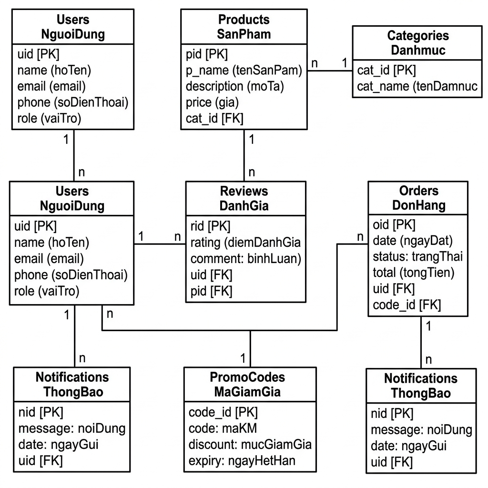
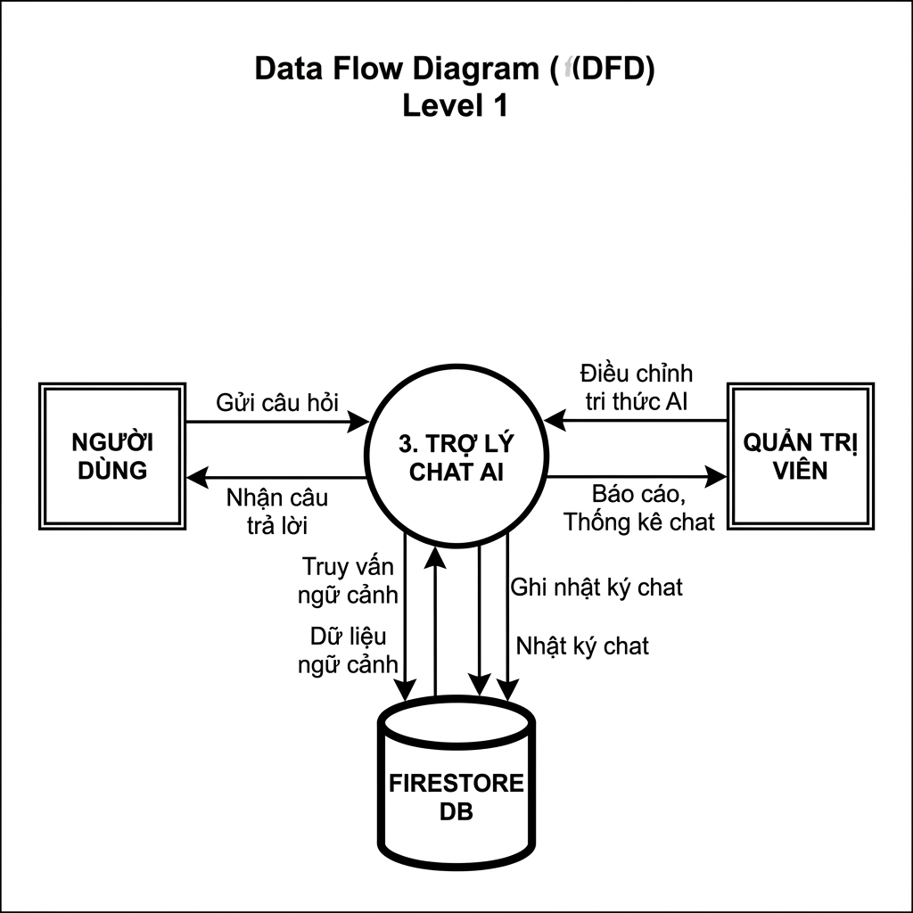
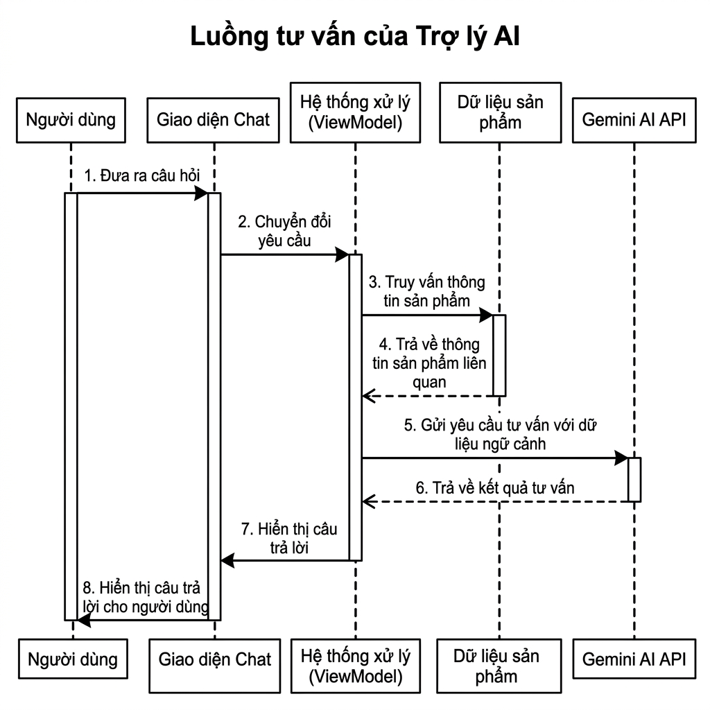
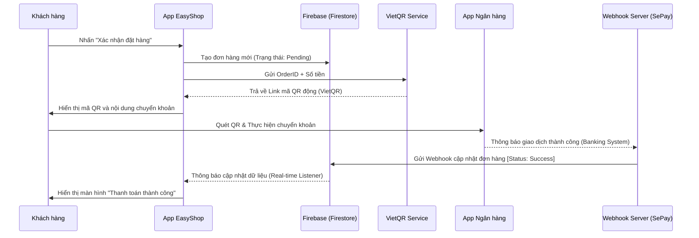
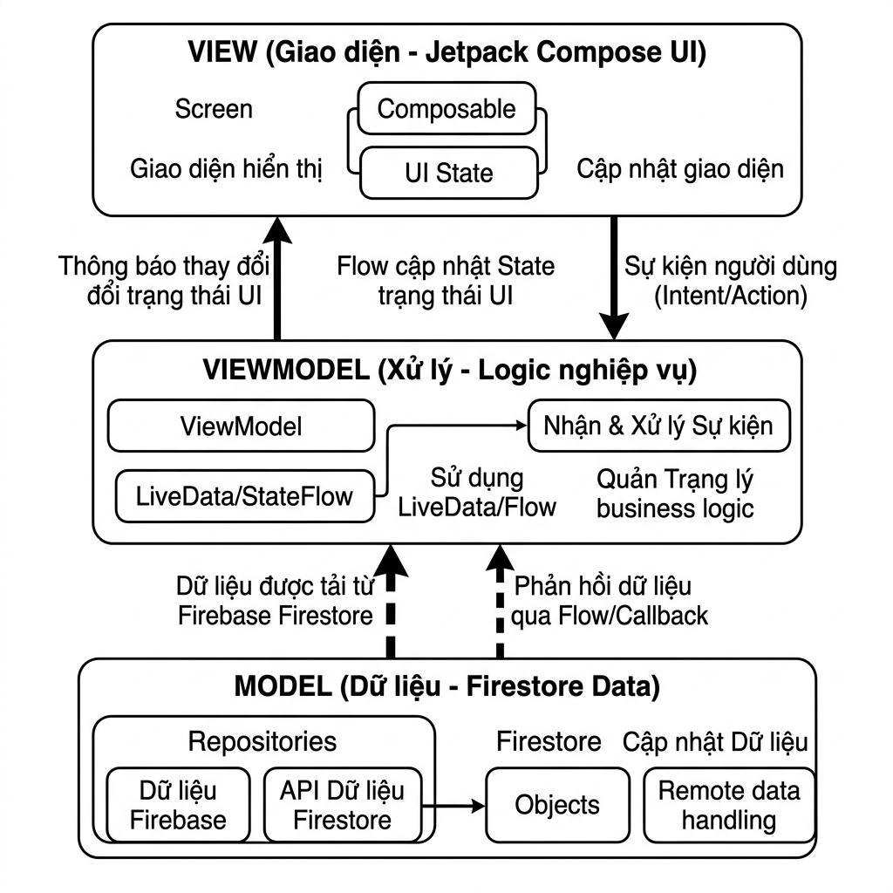
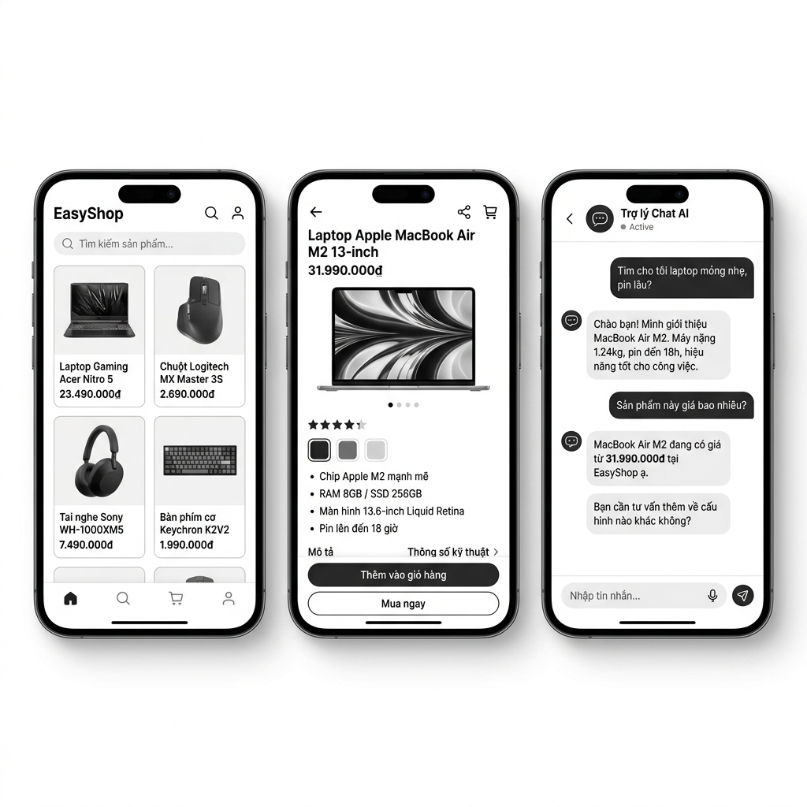

# Chương 3: PHÂN TÍCH & THIẾT KẾ HỆ THỐNG

## 3.1. Phân tích yêu cầu

### 3.1.1. Yêu cầu chức năng
Phần này mô tả chi tiết các hành động và nhiệm vụ mà hệ thống EasyShop phải thực hiện để đáp ứng nhu cầu của các tác nhân:

- **Đối với Khách hàng (User):**
  - **Đăng ký/Đăng nhập:** Hỗ trợ xác thực linh hoạt qua Email/Password hoặc tài khoản Google (tích hợp Firebase Auth) để đảm bảo tính tiện dụng và bảo mật.
  - **Tra cứu và Tìm kiếm:** Cho phép người dùng tìm kiếm nhanh và lọc sản phẩm công nghệ theo các danh mục như Laptop, linh kiện CPU, RAM, GPU...
  - **Quản lý giỏ hàng:** Thực hiện các thao tác thêm mới, xóa và cập nhật số lượng linh kiện một cách trực quan.
  - **Đặt hàng:** Xác nhận quy trình đơn hàng và theo dõi lịch sử mua sắm cá nhân.
  - **Trợ lý AI:** Gửi yêu cầu tư vấn chuyên sâu (ví dụ: "Tư vấn cấu hình PC 20 triệu chơi game") và nhận phản hồi phân tích chi tiết từ mô hình Gemini API dựa trên kho dữ liệu thực tế.

- **Đối với Quản trị viên (Admin):**
  - **Quản lý danh mục sản phẩm:** Thực hiện các nghiệp vụ thêm mới, cập nhật thông số kỹ thuật chi tiết và kiểm soát số lượng tồn kho theo thời gian thực.
  - **Quản lý đơn hàng:** Theo dõi luồng trạng thái đơn hàng và xác nhận xử lý các yêu cầu từ phía khách hàng.
  - **Quản lý mã giảm giá:** Tùy biến tạo mới và áp dụng các chương trình khuyến mãi, Voucher để kích cầu mua sắm.

### 3.1.2. Yêu cầu phi chức năng
- **Bảo mật:** Toàn bộ dữ liệu người dùng và giao dịch mua sắm phải được mã hóa và phân quyền truy cập nghiêm ngặt thông qua hệ thống **Firebase Security Rules**.
- **Tốc độ phản hồi AI:** Tối ưu hóa thời gian xử lý từ khi khách hàng gửi câu hỏi đến khi trợ lý ảo phản hồi (không quá 5-7 giây), sử dụng Coroutines để xử lý bất đồng bộ, tránh gây treo giao diện (UI Freeze).
- **Tính tương thích:** Ứng dụng phải hoạt động ổn định và mượt mà trên các thiết bị chạy hệ điều hành **Android 8.0 (Oreo)** trở lên.
- **Khả năng duy trì:** Mã nguồn được tổ chức theo kiến trúc sạch giúp dễ dàng bảo trì và nâng cấp các module AI trong tương lai.

## 3.2. Hệ thống biểu đồ (Phân tích tĩnh và động)

### 3.2.1. Sơ đồ Use Case
Biểu đồ Use Case thể hiện các mối quan hệ tương tác giữa ba tác nhân chính: Khách hàng (Chưa đăng nhập), Người mua (Đã đăng nhập) và Quản trị viên đối với các chức năng của hệ thống EasyShop.

```mermaid
flowchart TD
    %% Tác nhân (Actors)
    Guest["Khách (Chưa đăng nhập)"]
    Buyer["Người mua (Đã đăng nhập)"]
    Admin["Quản trị viên"]

    subgraph System ["Hệ thống App EasyShop"]
        direction TB
        UC1(["Xem sản phẩm và Tìm kiếm"])
        UC2(["Đăng ký / Đăng nhập"])
        UC3(["Quản lý Giỏ hàng"])
        UC4(["Thanh toán đơn hàng"])
        UC5(["Xem lịch sử mua"])
        UC6(["Đánh giá sản phẩm"])
        UC7(["Tư vấn bằng Chatbot AI"])
        UC8(["Xem Dashboard"])
        UC9(["Quản lý sản phẩm và Danh mục"])
        UC10(["Quản lý Đơn hàng"])
        UC11(["Quản lý Khuyến mãi"])
    end

    %% Quan hệ của Khách
    Guest --- UC1
    Guest --- UC2

    %% Quan hệ của Người mua
    Buyer --- UC1
    Buyer --- UC3
    Buyer --- UC4
    Buyer --- UC5
    Buyer --- UC6
    Buyer --- UC7

    %% Quan hệ của Admin
    Admin --- UC8
    Admin --- UC9
    Admin --- UC10
    Admin --- UC11

    %% Định dạng hình khối
    style Guest fill:#f9f,stroke:#333,stroke-width:2px
    style Buyer fill:#f9f,stroke:#333,stroke-width:2px
    style Admin fill:#f9f,stroke:#333,stroke-width:2px
```

*Hình 3.1. Sơ đồ Use Case tổng quát hệ thống EasyShop*

### 3.2.2. Sơ đồ Thực thể liên kết (ERD)
Vì sử dụng hệ quản trị cơ sở dữ liệu phi quan hệ Firestore (NoSQL), sơ đồ ERD tập trung vào việc đặc tả các liên kết dữ liệu giữa các bộ sưu tập chính (Collections): `Users`, `Products`, `Orders`, và đặc biệt là `ChatHistory` để lưu trữ ngữ cảnh hội thoại AI.

*Hình 3.2. Sơ đồ Thực thể liên kết (ERD) của hệ thống*

### 3.2.3. Sơ đồ Luồng dữ liệu (DFD)
Sơ đồ DFD mô tả quy trình dữ liệu chảy từ khi người dùng nhập câu hỏi tư vấn -> Qua logic xử lý của App -> Chuyển tiếp đến Gemini Cloud -> Nhận kết quả và hiển thị lại cho người dùng theo thời gian thực.

*Hình 3.3. Sơ đồ Luồng dữ liệu (DFD) mức 1*

### 3.2.4. Sơ đồ Trình tự (Sequence Diagram)
Phần này tập trung vẽ chi tiết cho luồng **"Tư vấn cấu hình qua AI"**. Đây là luồng xử lý phức tạp nhất, thể hiện sự tương tác đa chiều giữa Mobile App, Firebase và External API (Gemini).

*Hình 3.4. Sơ đồ Trình tự (Sequence Diagram) luồng tư vấn AI*

### 3.2.5. Sơ đồ Trình tự luồng Thanh toán tự động (MBBank & SePay Webhook)
Đây là sơ đồ mô tả cách hệ thống tích hợp giải pháp **SePay** để tự động hóa việc xác nhận đơn hàng. Quy trình này tận dụng cơ chế Webhook để lắng nghe tín hiệu từ hệ thống ngân hàng và cập nhật dữ liệu thời gian thực lên Firebase.

*Hình 3.5. Sơ đồ Trình tự (Sequence Diagram) luồng thanh toán QR Code*

## 3.3. Thiết kế hệ thống

### 3.3.1. Kiến trúc hệ thống
EasyShop áp dụng mô hình **Client-Server** hiện đại:
- **Client Side:** Android App được xây dựng hoàn toàn bằng ngôn ngữ Kotlin và Jetpack Compose, áp dụng kiến trúc **MVVM** để tách biệt rõ rệt tầng giao diện (View) và tầng logic dữ liệu (ViewModel/Model).
- **Server Side:** Sử dụng Firebase làm nền tảng lưu trữ và xác thực.
- **AI Integration:** Kết nối trực tiếp với Gemini API để thực hiện các tác vụ phân tích ngôn ngữ tự nhiên.

*Hình 3.5. Kiến trúc hệ thống tổng thể của ứng dụng*

### 3.3.2. Thiết kế Cơ sở dữ liệu
Dữ liệu trong Firestore được thiết kế theo hướng "linh hoạt" (Flexible Schema). Đặc biệt trong Collection `Products`, mỗi tài liệu có thể chứa các trường thông số kỹ thuật (Specs) đa dạng tùy thuộc vào loại sản phẩm (ví dụ: Laptop sẽ có trường `Battery`, `ScreenSize`; trong khi CPU sẽ có `Socket`, `CoreCount`).

### 3.3.3. Thiết kế Giao diện (Mockups)
Các bản vẽ phác thảo mô tả kiến trúc tầng giao diện được cài đặt bằng Jetpack Compose cho các màn hình then chốt:
- **Trang chủ (Home):** Hiển thị danh sách sản phẩm và banner khuyến mãi.
- **Chi tiết sản phẩm (Product Detail):** Thông số kĩ thuật đầy đủ và nút thêm vào giỏ.
- **Giỏ hàng (Cart):** Quản lý vật phẩm chuẩn bị thanh toán.
- **Màn hình Trợ lý AI (AI Chat):** Giao diện hội thoại trực quan nơi khách hàng tương tác với trí tuệ nhân tạo.

*Hình 3.6. Giao diện Mockups các màn hình chính của ứng dụng*
