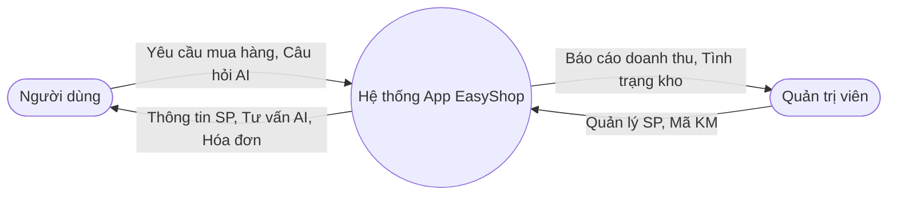
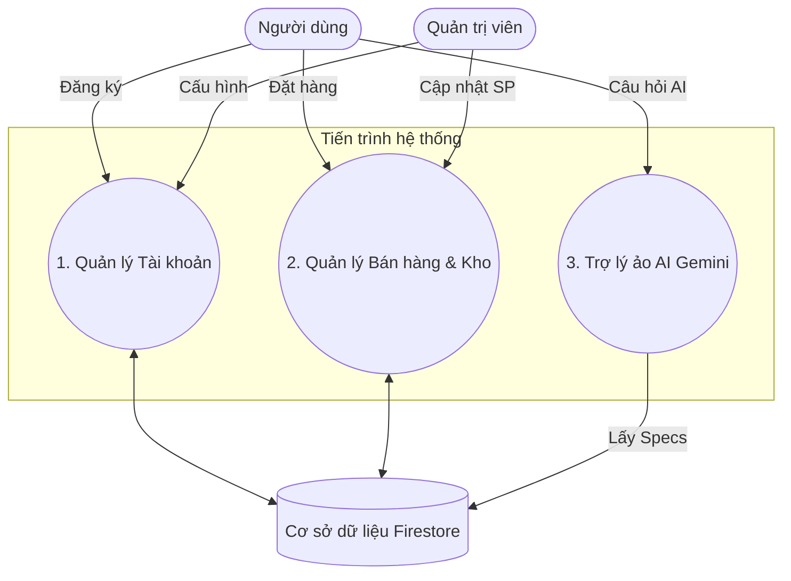

# Sơ đồ DFD (Data Flow Diagram) - EasyShop

## 1. DFD Mức ngữ cảnh (Mức 0)

```mermaid
graph LR
    User([Người dùng])
    System((Hệ thống App EasyShop))
    Admin([Quản trị viên])

    User -- "Yêu cầu mua hàng, Câu hỏi AI" --> System
    System -- "Thông tin SP, Tư vấn AI, Hóa đơn" --> User

    Admin -- "Quản lý SP, Mã KM" --> System
    System -- "Báo cáo doanh thu, Tình trạng kho" --> Admin
```

## 2. DFD Mức đỉnh (Mức 1)

```mermaid
flowchart TD
    User([Người dùng])
    Admin([Quản trị viên])
    
    subgraph Processes ["Tiến trình hệ thống"]
        P1((1. Quản lý Tài khoản))
        P2((2. Quản lý Bán hàng & Kho))
        P3((3. Trợ lý ảo AI Gemini))
    end
    
    db[(Cơ sở dữ liệu Firestore)]

    User -- "Đăng ký" --> P1
    User -- "Đặt hàng" --> P2
    User -- "Câu hỏi AI" --> P3

    Admin -- "Cấu hình" --> P1
    Admin -- "Cập nhật SP" --> P2

    P1 <--> db
    P2 <--> db
    P3 -- "Lấy Specs" --> db
```
