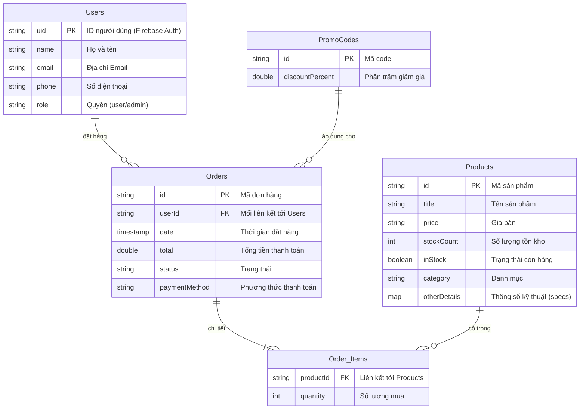

# Sơ đồ ERD (Entity Relationship Diagram) - EasyShop (Firestore)

```mermaid
erDiagram
    Users ||--o{ Orders : "đặt hàng"
    Orders ||--|{ Order_Items : "chi tiết"
    Products ||--o{ Order_Items : "có trong"
    PromoCodes ||--o{ Orders : "áp dụng cho"

    Users {
        string uid PK "ID người dùng (Firebase Auth)"
        string name "Họ và tên"
        string email "Địa chỉ Email"
        string phone "Số điện thoại"
        string role "Quyền (user/admin)"
    }

    Products {
        string id PK "Mã sản phẩm"
        string title "Tên sản phẩm"
        string price "Giá bán"
        int stockCount "Số lượng tồn kho"
        boolean inStock "Trạng thái còn hàng"
        string category "Danh mục"
        map otherDetails "Thông số kỹ thuật (specs)"
    }

    Orders {
        string id PK "Mã đơn hàng"
        string userId FK "Mối liên kết tới Users"
        timestamp date "Thời gian đặt hàng"
        double total "Tổng tiền thanh toán"
        string status "Trạng thái"
        string paymentMethod "Phương thức thanh toán"
    }

    Order_Items {
        string productId FK "Liên kết tới Products"
        int quantity "Số lượng mua"
    }

    PromoCodes {
        string id PK "Mã code"
        double discountPercent "Phần trăm giảm giá"
    }
```
