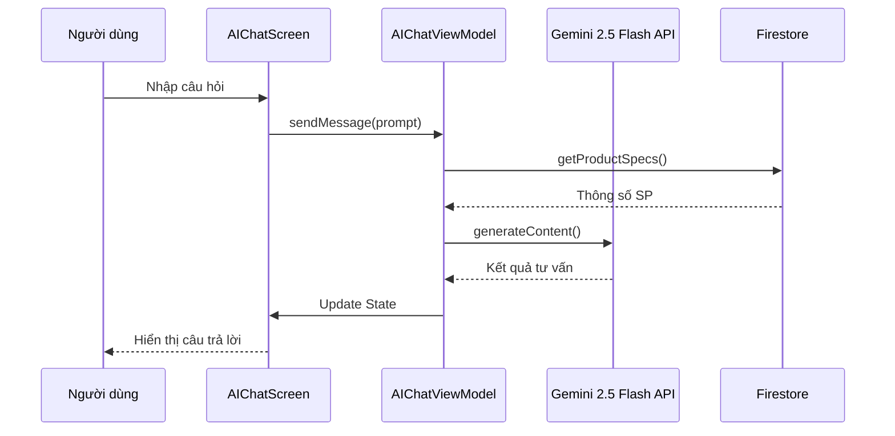
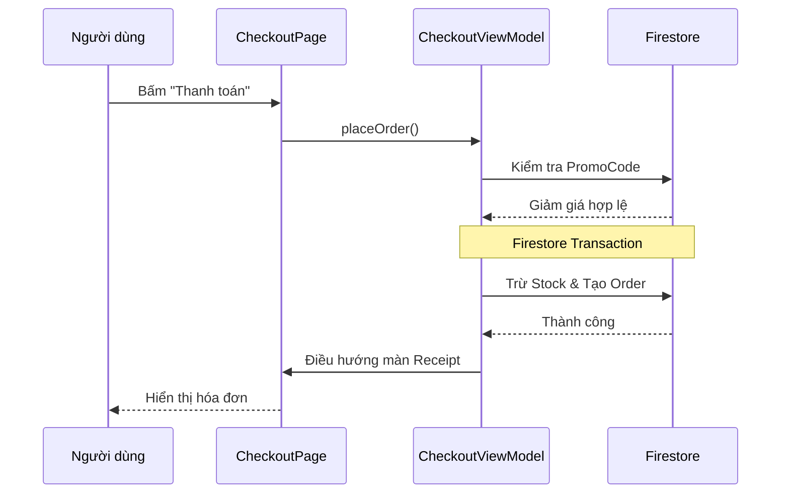

# Sơ đồ UML Sequence - EasyShop

## 1. Luồng Chat tư vấn với Trợ lý ảo AI

```mermaid
sequenceDiagram
    participant User as Người dùng
    participant UI as AIChatScreen
    participant VM as AIChatViewModel
    participant Gemini as Gemini 2.5 Flash API
    participant DB as Firestore

    User->>UI: Nhập câu hỏi
    UI->>VM: sendMessage(prompt)
    VM->>DB: getProductSpecs()
    DB-->>VM: Thông số SP
    VM->>Gemini: generateContent()
    Gemini-->>VM: Kết quả tư vấn
    VM->>UI: Update State
    UI-->>User: Hiển thị câu trả lời
```

## 2. Luồng Thanh toán đơn hàng (Checkout)

```mermaid
sequenceDiagram
    participant User as Người dùng
    participant UI as CheckoutPage
    participant VM as CheckoutViewModel
    participant DB as Firestore

    User->>UI: Bấm "Thanh toán"
    UI->>VM: placeOrder()
    VM->>DB: Kiểm tra PromoCode
    DB-->>VM: Giảm giá hợp lệ
    Note over VM, DB: Firestore Transaction
    VM->>DB: Trừ Stock & Tạo Order
    DB-->>VM: Thành công
    VM->>UI: Điều hướng màn Receipt
    UI-->>User: Hiển thị hóa đơn
```
