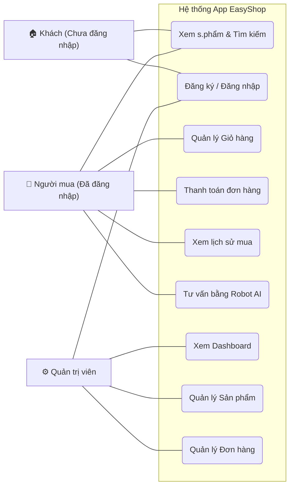

# Sơ đồ Use Case (Ca sử dụng) - EasyShop (Phiên bản chuẩn HUBT)

```mermaid
graph LR
    Guest["🏠 Khách (Chưa đăng nhập)"]
    User["👤 Người mua (Đã đăng nhập)"]
    Admin["⚙️ Quản trị viên"]
    
    subgraph "Hệ thống App EasyShop"
        UC_Browse(Xem s.phẩm & Tìm kiếm)
        UC_Sign(Đăng ký / Đăng nhập)
        
        UC_Cart(Quản lý Giỏ hàng)
        UC_Pay(Thanh toán đơn hàng)
        UC_History(Xem lịch sử mua)
        UC_AI(Tư vấn bằng Robot AI)
        
        UC_Dash(Xem Dashboard)
        UC_Items(Quản lý Sản phẩm)
        UC_Orders(Quản lý Đơn hàng)
    end

    %% Các liên kết của Khách
    Guest --- UC_Browse
    Guest --- UC_Sign

    %% Các liên kết của Người mua
    User --- UC_Browse
    User --- UC_Cart
    User --- UC_Pay
    User --- UC_History
    User --- UC_AI

    %% Các liên kết của Admin
    Admin --- UC_Sign
    Admin --- UC_Dash
    Admin --- UC_Items
    Admin --- UC_Orders
```
